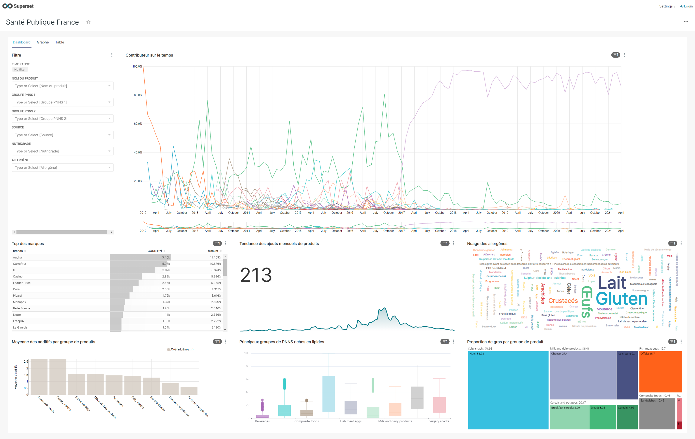

# Préparation des données OpenFoodFacts pour Santé Publique France

Visualiser le notebook en ligne : 

L'agence "Santé publique France" a lancé un appel à projets pour rendre les données de santé plus accessibles.

L’agence souhaite faire explorer et visualiser les données d'OpenFoodFacts pour que ses agents puissent les exploiter.

## Visualiser le Dashboard en ligne avec Apache Superset

## [Lire la présentation](https://github.com/Abdess/sante_publique_france/raw/main/P3_03_Pr%C3%A9sentation.pptx)

## Préparation de l'environnement

    pip install -r requirements.txt

## Explorer le notebook de nettoyage

    jupyter notebook P3_01_nettoyage.ipynb

## Visualiser le Dashboard Voilà

    voila --template=flex P3_02_dashboard.ipynb
